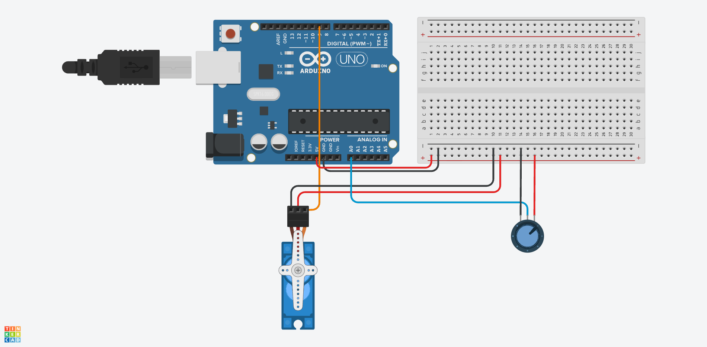

## Servo Motor Potentionmeter

The first project built alone with arduino :)

#### Circuit Diagram:

#### Components:
- Stepper Servo Motor SG90
- Rotary Potentionmeter 10K

#### Demo:
  <video controls src="demo-video.mp4" title="Servo Motor Potentionmeter Demo Video" loop></video>